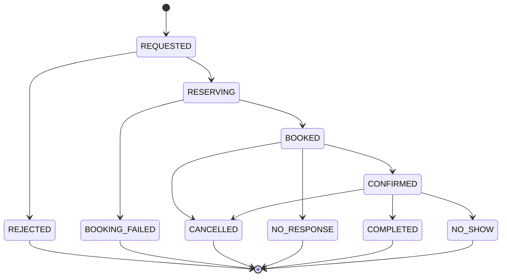
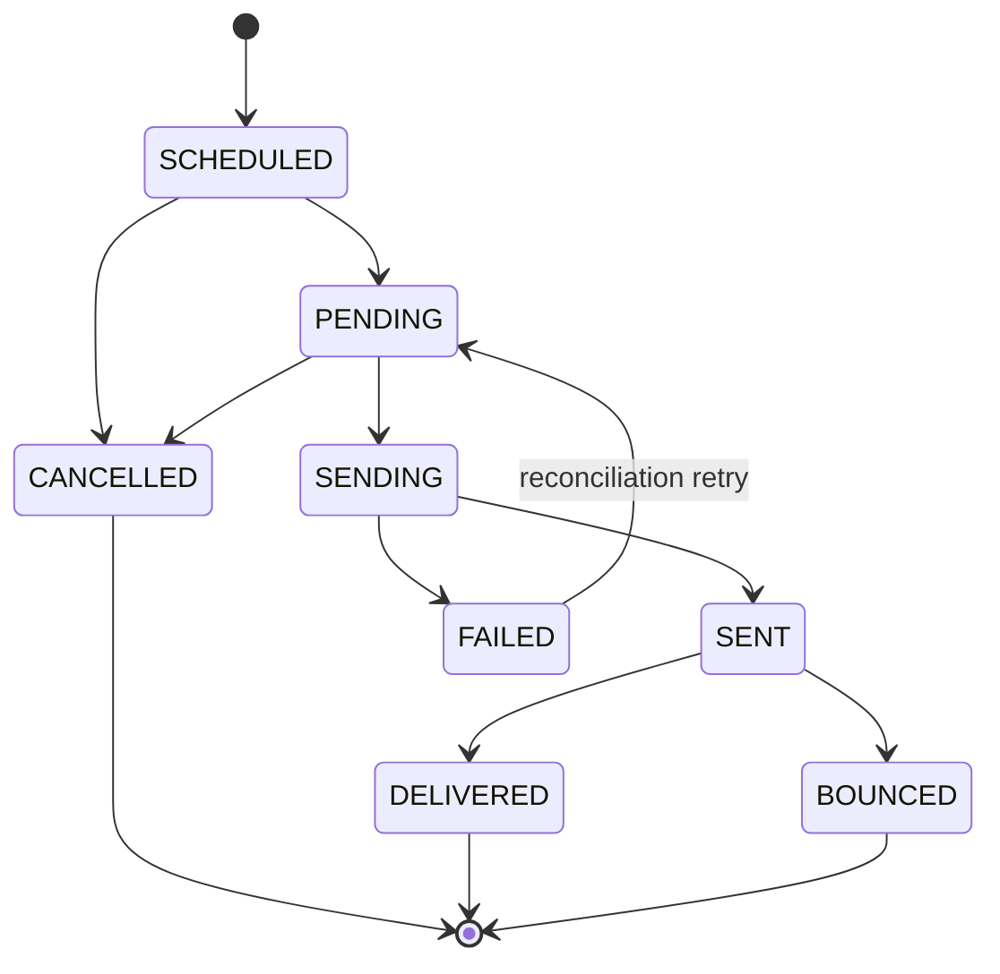
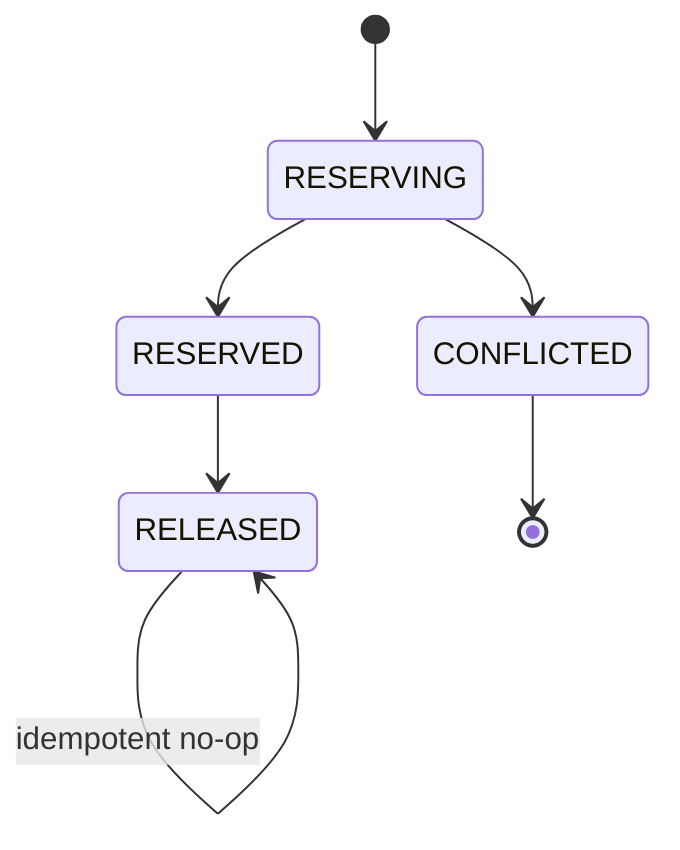
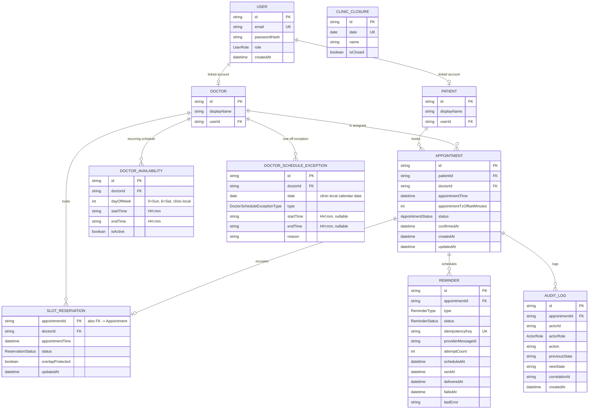
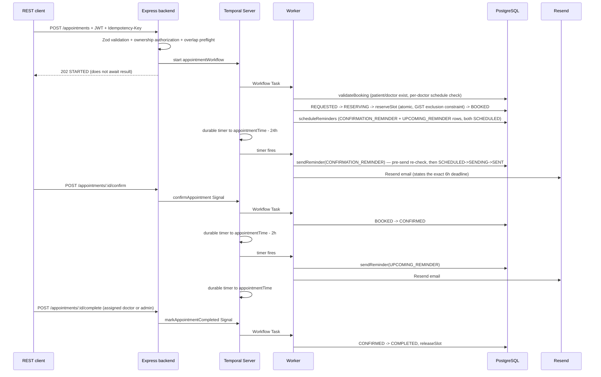

# Temporal Healthcare Appointment Service

A production-minded learning project for Temporal. It books an appointment against a **per-doctor
recurring schedule** (with leave/holiday exceptions), atomically reserves the slot in PostgreSQL, and
runs the entire confirmation lifecycle — 24-hour confirmation reminder, 6-hour confirmation deadline,
2-hour upcoming reminder, and post-appointment completion/no-show — as one durable Temporal workflow.
Three independent state machines (appointment, slot reservation, reminder) keep those concerns from
tangling together, and a reconciliation sweep self-heals anything a crashed process left behind.

## Start and use it

Only Docker Desktop with Compose is required:

```bash
docker compose up --build
```

- API: http://localhost:3000
- Readiness: http://localhost:3000/readiness (also aliased at `/health`); liveness: http://localhost:3000/liveness
- Frontend: http://localhost:8081 (React/Vite SPA — patient booking flow, doctor and admin dashboards)
- Temporal UI: http://localhost:8080
- PostgreSQL and Temporal gRPC are internal-only (not host-published).

Production images, deployment order, supported hosting targets, TLS/secrets requirements, observability, alerting, and rollback procedures are documented in [docs/operations.md](docs/operations.md). Database migration and demo seeding are separate one-shot Compose services; neither runs inside API startup.

Optional local metrics, dashboards, alerts, and OTLP trace export can be started with:

```bash
docker compose -f docker-compose.yml -f docker-compose.observability.yml --profile observability up --build
```

Local demo accounts all use `DemoPass123!`:

| Role | Email | Linked record |
|---|---|---|
| Patient | `patient1@example.test` | `patient-001` |
| Patient | `patient2@example.test` | `patient-002` |
| Doctor | `doctor1@example.test` | `doctor-001` (seeded with a Mon–Fri 7am–12pm/1pm–5pm schedule) |
| Admin | `admin@example.test` | all records |

These are fake, local-only identities. Compose credentials and its fallback JWT secret are intentionally
labelled development values; replace them for any shared environment.

### Example API flow

```bash
# Login and copy the token value from the response.
curl -s http://localhost:3000/auth/login \
  -H 'content-type: application/json' \
  -d '{"email":"patient1@example.test","password":"DemoPass123!"}'

TOKEN='<paste token>'

# See what's actually open for this doctor before picking a time.
curl -s "http://localhost:3000/doctors/doctor-001/available-slots?date=2026-09-14" \
  -H "authorization: Bearer $TOKEN"

# Idempotency-Key is required. Reusing it returns ALREADY_STARTED, even after
# the original Workflow has closed.
curl -s http://localhost:3000/appointments \
  -H "authorization: Bearer $TOKEN" \
  -H 'content-type: application/json' \
  -H 'idempotency-key: interview-demo-001' \
  -d '{"patientId":"patient-001","doctorId":"doctor-001","appointmentTime":"2026-09-14T08:00:00+05:30"}'

APPOINTMENT_ID='<appointmentId from response>'
curl -s http://localhost:3000/appointments/$APPOINTMENT_ID -H "authorization: Bearer $TOKEN"
curl -s http://localhost:3000/appointments/$APPOINTMENT_ID/workflow -H "authorization: Bearer $TOKEN"
curl -s -X POST http://localhost:3000/appointments/$APPOINTMENT_ID/confirm -H "authorization: Bearer $TOKEN"
# Or: POST /:id/cancel (patient/admin); POST /:id/complete or /:id/no-show (assigned doctor/admin, once CONFIRMED)
```

Compose defaults to the 24h / 6h / 2h confirmation policy described below. For a quick demo, shrink
`CONFIRMATION_REMINDER_HOURS_BEFORE` / `CONFIRMATION_DEADLINE_HOURS_BEFORE` / `UPCOMING_REMINDER_HOURS_BEFORE`
in `.env` and book an appointment just past the (now short) deadline window. Configuration is read by the
backend once and copied into the Workflow input; already-running Workflows keep the values they started with.

### Resend reminder email

The reminder Activity delivers real email through Resend for both reminder types. Create a local `.env`
file from `.env.example`, then set:

```dotenv
RESEND_API_KEY=re_your_key
RESEND_FROM_EMAIL=Healthcare Appointments <onboarding@resend.dev>
REMINDER_EMAIL_TO=your-real-test-inbox@example.com
```

The seeded users use reserved `example.test` addresses; when `REMINDER_EMAIL_TO` is set it overrides the
patient's on-file address so local delivery goes to one real inbox instead (Resend's sandbox mode also
restricts delivery to a single verified recipient). Leave it blank in a real deployment to send to the
actual patient address. The confirmation-reminder email states the patient/doctor name, the appointment
date/time, and the **exact confirmation deadline** — not "confirm soon" — plus what happens if the
deadline passes unanswered. The upcoming-reminder email never re-asks for confirmation. After changing
`.env`, recreate `backend` and `worker`:

```powershell
docker compose up -d --build --force-recreate backend worker
```

Both `RESEND_API_KEY` and a resolvable recipient are required. If either is missing when the reminder
Activity runs, it fails loudly (the `Reminder` row is marked `FAILED`, and the Activity retries) instead
of being silently marked as sent — an unconfigured provider must never look like a delivered reminder.

### Doctor scheduling and availability

Working hours are **per-doctor**, not a single global constant. Three tables compose into one effective
schedule (see the ERD below): `DoctorAvailability` (recurring weekly windows, clinic-local wall-clock time,
multiple windows per day), `DoctorScheduleException` (`UNAVAILABLE` or `CUSTOM_HOURS` for a single date —
a whole day, a partial-day range, or a full override), and `ClinicClosure` (clinic-wide holidays). Clinic
closed beats everything; a doctor's `UNAVAILABLE`/`CUSTOM_HOURS` exception for a date beats that date's
recurring windows; otherwise the recurring weekly schedule applies. Existing reservations always remove
whatever they occupy from the result.

```
GET    /doctors/:doctorId/available-slots?date=YYYY-MM-DD   # -> { doctorId, date, slots: [{startAt, endAt}] }
GET    /doctors/:doctorId/availability
POST   /doctors/:doctorId/availability                       # {dayOfWeek, startTime, endTime, isActive?} — doctor-self or admin
PUT    /doctors/:doctorId/availability/:itemId
DELETE /doctors/:doctorId/availability/:itemId
GET    /doctors/:doctorId/schedule-exceptions
POST   /doctors/:doctorId/schedule-exceptions                 # {date, type, startTime?, endTime?, reason?}
DELETE /doctors/:doctorId/schedule-exceptions/:itemId
GET    /clinic-closures
POST   /clinic-closures                                       # {date, name, isClosed?} — admin only
DELETE /clinic-closures/:itemId
```

The calculation is pure and shared (`shared/scheduling/availability.ts`): the backend uses it to answer
`GET .../available-slots`, and the Worker's `validateBooking` Activity uses the exact same function to
**authoritatively** re-check the requested time at booking time — it never trusts that the frontend
previously saw a slot as available. Recurring windows are stored as clinic-local `"HH:mm"` under a single
`CLINIC_TIMEZONE` (default `Asia/Colombo`) and converted to UTC only at calculation time via `Intl`-based
conversion, not a hardcoded numeric offset. Adding a leave exception never silently cancels an existing
appointment; `POST .../schedule-exceptions` returns any already-booked appointments the new exception now
conflicts with (`conflictingAppointments`) so a human can reschedule or resolve them.

Double-booking protection is unchanged and doctor-schedule-independent: a PostgreSQL GiST exclusion
constraint on `SlotReservation` (scoped to `status = 'RESERVED'`) is the actual concurrency authority —
two near-simultaneous reservation attempts for the same doctor/time can never both win.

## Appointment lifecycle

Ten states, one centralized transition table (`shared/appointment/appointment.state-machine.ts`) — every
write goes through it, nowhere else decides what a legal transition is:



The confirmation/reminder policy (all three offsets configurable, validated to be strictly decreasing):

```
appointmentTime - 24h  ->  CONFIRMATION_REMINDER sent (states the exact 6h deadline)
appointmentTime -  6h  ->  confirmation deadline: still BOOKED with no response -> NO_RESPONSE, slot released
appointmentTime -  2h  ->  UPCOMING_REMINDER sent, only if still CONFIRMED
appointmentTime        ->  the Workflow waits for a doctor/admin to record COMPLETED or NO_SHOW
```

A booking made **after** its own 6-hour deadline has already passed (a same-day booking) is auto-confirmed
immediately rather than racing straight to `NO_RESPONSE` — the confirmation reminder is cancelled, not
sent. If even the 2-hour mark has already passed at booking time, the upcoming reminder is cancelled too
instead of firing immediately.

Reminder failures never change appointment status: `Reminder = FAILED` while `Appointment = BOOKED` is a
normal, expected state, not an error condition — the reconciliation sweep retries it while it's still
eligible.

## Reminder and reservation lifecycles



Two reminder types per appointment (`CONFIRMATION_REMINDER`, `UPCOMING_REMINDER`), each with its own row,
its own deterministic idempotency key (`appointment-{id}-confirmation-reminder` / `-upcoming-reminder`,
reused across retries and reconciliation so a crash-and-retry can never send twice), and its own
pre-send validation (re-checks the appointment is still in the right status and still upcoming
*immediately* before calling Resend — not just when the reminder was scheduled).

Slot reservation is a third, independent state machine:



A reminder being sent, delivered, or failed never releases a slot by itself — only an appointment
lifecycle decision (cancel, no-response, completion, no-show) does, and `releaseSlot` is safe to call
any number of times.

## Data model (ERD)

A standalone, styled version of this diagram — with a scannable field-reference card per table — is
saved at [`docs/clinic-schema-chart.html`](docs/clinic-schema-chart.html); open it directly in a browser.



`SlotReservation.appointmentId` is both its primary key and its foreign key to `Appointment` — one
reservation attempt per appointment, never shared. `ClinicClosure` has no direct foreign keys to anything
else; it's checked by date against every doctor uniformly.

### Reconciliation

A Temporal Schedule (`appointment-reconciliation`, created idempotently on backend startup) runs
`reconciliationWorkflow` every `RECONCILIATION_INTERVAL_MINUTES` (default 15, each query capped at
`RECONCILIATION_BATCH_SIZE` rows per sweep so a large backlog is drained over several passes instead of
one that balloons its own Workflow history) to reconcile state the normal lifecycle couldn't complete
itself — a terminated Workflow, an Activity that exhausted its own retry budget, or a manual/external
change (a merely crashed-and-restarted worker is *not* a cause on its own: Temporal persists Workflow
history and a restarted worker resumes normally):

- **Stale slot reservations** — still `RESERVED` on an appointment already in a terminal status
  (`CANCELLED`, `NO_RESPONSE`, `COMPLETED`, `NO_SHOW`). Safe to auto-release: the terminal status is proof
  the owning Workflow already made its final decision.
- **Orphaned scheduled reminders** — still `SCHEDULED`/`PENDING` on a `CANCELLED` appointment. Auto-cancelled.
- **Failed reminders still eligible to retry** — a `FAILED` `CONFIRMATION_REMINDER` while still `BOOKED`
  and before its own deadline, or a `FAILED` `UPCOMING_REMINDER` while still `CONFIRMED` and before the
  appointment time. Retried through the exact same idempotent send path; a reminder past its own
  meaningful window is never retried.
- **Appointments stuck at `BOOKED`** past their own confirmation deadline, or **stuck at `CONFIRMED`**
  well past their own appointment time with no `COMPLETED`/`NO_SHOW` ever recorded — detected and logged
  for on-call, never auto-mutated. Guessing the outcome (did the doctor forget, or did the Workflow die?)
  is a business call, not something to automate.

### Health, rate limiting, and Temporal connectivity

`GET /liveness` answers "is the process alive?" with no dependency checks, so a slow/unavailable
dependency never causes an orchestrator to kill an otherwise-healthy process. `GET /readiness` (also
aliased at `/health`) independently checks PostgreSQL (`SELECT 1`), Temporal (`getSystemInfo`), and Redis
(`PING`), returning `503` with a per-dependency breakdown if any is unreachable.

HTTP rate limits use `express-rate-limit` with `rate-limit-redis` and the process-wide `ioredis` client,
so atomic fixed-window counters are shared by every backend replica. Defaults are 5 login attempts/minute
per IP plus 10/15 minutes per normalized-and-hashed account, 10 bookings/minute per authenticated user,
20 confirms and 20 cancellations/minute per authenticated user, and 30 management mutations/minute per
authenticated user. Every limit and window has a validated `RATE_LIMIT_*` environment variable.

Blocked requests return `429` with `Retry-After`, standard `RateLimit` headers, and a stable
`RATE_LIMIT_EXCEEDED` JSON error. Redis store errors are logged and fail open so an abuse-control outage
does not bypass authentication, authorization, idempotency, Temporal orchestration, or PostgreSQL booking
constraints; readiness still reports Redis unavailable. `TRUST_PROXY_HOPS` defaults to `0`. Set it only
to the exact number of reverse proxies/load balancers in front of Express so client IP keys use trusted
forwarding data without accepting arbitrary `X-Forwarded-For` headers.

`TEMPORAL_TLS` and `TEMPORAL_API_KEY` let the backend and Worker connect to a TLS-secured Temporal cluster
or Temporal Cloud (API-key auth implies TLS); both default to plaintext for the local Compose network.
`JWT_SECRET` is refused at startup if it's still the local-development default and `NODE_ENV=production` —
a real deployment must supply its own secret rather than silently signing tokens with a value that's
public in this repo's history.

## Architecture and project tree

```text
REST client -> Express backend -> reused Temporal Client -> Temporal Server
                                                         -> healthcare-appointments queue
                                                         -> bounded Worker
                                                            |-> one deterministic appointmentWorkflow (+ reconciliationWorkflow)
                                                            `-> Activities -> PostgreSQL / Resend
```

```text
.
├── docker/postgres/init.sql
├── prisma/
│   ├── migrations/            # init -> 20-minute slots -> lifecycle state machines -> doctor scheduling
│   ├── schema.prisma
│   └── seed.ts
├── frontend/                  # React/Vite SPA: login, booking, lookup, patient/doctor/admin dashboards
│   └── src/...
├── src/
│   ├── backend/                    # HTTP service boundary
│   │   ├── api/                    # controllers, routes, schemas, middleware (appointment.*, doctorSchedule.*)
│   │   ├── auth/                   # login, JWT verification, authorization
│   │   ├── redis/                  # rate-limit store client
│   │   ├── temporal/               # reused Temporal client + reconciliation Schedule setup
│   │   ├── app.ts
│   │   └── server.ts               # backend container entry point
│   ├── worker/                     # Temporal execution service boundary
│   │   ├── activities/             # appointment / reservation / reminder / reconciliation Activities
│   │   ├── appointment/            # appointment repository (the one place transitions are written)
│   │   ├── reservation/            # slot reservation repository (atomic reserve/release)
│   │   ├── reminder/               # reminder repository
│   │   ├── scheduling/             # doctor-availability repository (read-only, feeds validateBooking)
│   │   ├── audit/                  # audit log repository
│   │   ├── notifications/          # Resend integration
│   │   ├── workflows/              # appointmentWorkflow + reconciliationWorkflow
│   │   └── worker.ts               # worker container entry point
│   └── shared/                     # modules genuinely needed by both boundaries — no infrastructure entry point
│       ├── appointment/            # AppointmentStatus + its state machine
│       ├── reservation/            # ReservationStatus + its state machine
│       ├── reminder/               # ReminderType/Status, state machine, schedule policy, email templates
│       ├── scheduling/             # timezone conversion + the pure available-slots calculation
│       ├── config/
│       ├── database/
│       ├── logging/
│       └── temporal/               # contracts, Signals, Queries
├── tests/                     # Temporal time-skipping + pure-logic + validation/auth + architecture tests
├── .env.example
├── Dockerfile
├── docker-compose.yml
└── package.json
```

This is one repository containing two backend applications plus a frontend, not one combined process.
Compose runs a `backend` container (`dist/src/backend/server.js`), a separate `worker` container
(`dist/src/worker/worker.js`), and a `frontend` container (static build served by nginx). `backend` and
`worker` reuse one image because their Node dependencies overlap, but have different entry points,
lifecycles, and scaling behavior.

The backend only validates/authenticates HTTP and starts, signals, or queries Workflows (plus its own
direct, read-oriented Prisma queries for things like `GET .../available-slots` and booking preflight
checks). It never executes Activities. The worker never serves HTTP; it polls the Task Queue and executes
Workflows and Activities. `shared/` contains no application entry point and is intentionally limited to
cross-boundary contracts, pure domain logic (state machines, the availability calculation, reminder
scheduling math), and process infrastructure (config/database/logging clients). PostgreSQL is the
business-data source of truth; Temporal is the execution-state source of truth.

These boundaries are executable rules in `tests/architecture.test.ts`: backend cannot import worker
implementation, worker cannot import backend implementation, shared code cannot depend on either
application, and Workflow modules cannot import Prisma, configuration, logging, filesystem, HTTP, or
crypto infrastructure. The test fails immediately if a future refactor crosses one of those boundaries.

## End-to-end execution



The Task Queue is a durable routing name, not a broker the application manages. The backend may restart
immediately after `start` returns; Temporal retains the Workflow history. A worker restart causes another
worker poll to replay deterministic workflow code and continue at the last durable event. Every timer
(confirmation reminder, deadline, upcoming reminder) lives in Temporal, not in Node memory.

`POST /appointments` requires an `Idempotency-Key`. The backend scopes it to the authenticated user,
derives a stable appointment/Workflow ID, and starts with `workflowIdConflictPolicy: FAIL` plus
`workflowIdReusePolicy: REJECT_DUPLICATE`. The same logical request therefore cannot create another run
while the original Workflow is open or after it has closed.

## Temporal concepts demonstrated

- One long-running `appointmentWorkflow` per appointment orchestrates the entire lifecycle — booking,
  the confirmation window, the upcoming-reminder window, and the post-appointment completion/no-show
  wait — with no child-workflow handoff between phases.
- Four Signals: `confirmAppointment`, `cancelAppointment`, `markAppointmentCompleted`,
  `markAppointmentNoShow`, each gated on the Workflow's current in-memory status so an out-of-order
  Signal is a documented no-op rather than an error.
- A single `appointmentState` Query exposes appointment/reservation status, all three reminder
  timestamps, and whether each reminder has been attempted — read-only, no database work.
- `reconciliationWorkflow` runs on a Temporal Schedule, calling only Activities that can prove a mutation
  is currently safe; anything ambiguous is logged for a human, never guessed at.
- Retry policies are tuned per Activity group (booking/reservation vs. reminder-send) with
  `scheduleToCloseTimeout` sized to actually accommodate the configured `maximumAttempts` and backoff —
  not just a round number.
- IDs, timestamps, an integer offset, and the three configured reminder-policy hours are the entire
  Workflow payload — no JWT, name, password, diagnosis, or patient record enters Event History.

Temporal replaces fragile combinations of cron, in-memory `setTimeout`, polling tables, custom retry
loops, and hand-built state machines. It supplies persisted history, deterministic replay, durable
timers, retry scheduling, human-interaction Signals, Queries, and UI visibility as one execution model.

## Failure tolerance

| Mechanism | Where | Behavior during failure |
|---|---|---|
| Activity retry/backoff | Workflow `proxyActivities` options, one policy per Activity group | Transient DB/provider errors retry 3–5 times with exponential backoff; `scheduleToCloseTimeout` is sized to actually fit the worst case. |
| Non-retryable business errors | Activities use `ApplicationFailure.nonRetryable` | Invalid time, missing entities, an unavailable slot, and an invalid state transition fail immediately instead of wasting retries. |
| Reminder send never crashes the lifecycle | `appointmentWorkflow`'s `sendReminderBestEffort` wrapper | An exhausted reminder-send failure is swallowed after the Activity durably records `Reminder = FAILED` — it never changes `Appointment.status` or aborts the Workflow. |
| Database slot constraints | Exact-start uniqueness plus a PostgreSQL GiST exclusion constraint, scoped to `RESERVED` rows | Two workers racing for overlapping time ranges for the same doctor cannot both win; the loser's row becomes `CONFLICTED` and the constraint error becomes `DOCTOR_UNAVAILABLE`. |
| Idempotent Activities | primary/unique keys, upsert/guarded updates, status-guarded `updateMany` | Retries cannot duplicate an appointment, reservation, release, reminder send, or state transition — including `releaseSlot`, safe to call any number of times. |
| Saga compensation | `appointmentWorkflow`'s `catch` around `reserveSlot`/the `BOOKED` transition | A conflict or permanent/exhausted failure releases the reservation before marking `BOOKING_FAILED`; a genuine `DOCTOR_UNAVAILABLE` conflict is distinguished from an infrastructure failure. |
| Durable state/timer | Temporal Event History and `sleep`/`condition` | Worker, backend, or container restarts do not lose progress or any of the three reminder-policy timers. |
| Connection retry | backend client and worker startup | Dependencies are retried with bounded increasing delays; Compose health gates also prevent premature startup. |
| Graceful shutdown | server close and Worker SDK run loop | Backend stops accepting HTTP and closes clients; worker handles SIGTERM/SIGINT, drains, then closes Temporal/Prisma. |

Reminder delivery requires Resend to be configured; an unconfigured provider fails the Activity rather
than being recorded as sent. A unique idempotency key per appointment+reminder-type prevents a repeat
send during Activity retries or a reconciliation-triggered retry. Resend retains idempotency keys for 24
hours; production delivery still needs reconciliation or a transactional outbox because no local database
can atomically commit with an unrelated provider.

### Deliberate failure demonstrations

Tests cover transient reminder-send retry and permanent reservation/booking-creation failures. For a live
demo, set the worker mode before starting:

```powershell
$env:DEMO_FAILURE_MODE='notification-once' # or create-permanent
docker compose up -d --force-recreate worker
```

Start a new appointment with a new idempotency key and inspect attempts/events in Temporal UI. Reset with
`$env:DEMO_FAILURE_MODE='none'`. To demonstrate recovery, stop the worker while a durable timer is
pending, then start it again; the timer remains in Temporal. Restarting only `backend` likewise has no
effect on the Workflow.

## Efficiency choices

- One Temporal connection/client per backend process and one Prisma client per backend/worker process.
- One logical Task Queue; worker concurrency is bounded at 20 Activities and 50 Workflow Tasks.
- Small Workflow arguments/results and no database/network work in Workflow code — everything routes
  through an Activity, including every read the availability engine needs.
- Short transactions/atomic statements only; no transaction spans Temporal, a notification call, timer,
  or human wait.
- Narrow Prisma `select` projections, parallel independent existence checks, no list/N+1 path.
- Reconciliation queries are capped by `RECONCILIATION_BATCH_SIZE` per sweep rather than scanning an
  unbounded backlog in one Workflow execution.
- Only query-driven indexes: patient, appointment time, status, exact-start uniqueness, the 20-minute
  overlap exclusion constraint, and per-doctor/day lookups for availability and exceptions.
- Multi-stage Node 20 slim image, deterministic `npm ci`, non-root runtime, and no unnecessary services.

At higher scale, tune Temporal pollers/concurrency from metrics, add connection-pool sizing, and separate
migrations from horizontally scaled API startup. Rate limiting is already Redis-backed (see Health, rate
limiting, and Temporal connectivity above) rather than in-process, and reminder retries are already
idempotency-key-safe at the provider (see Reconciliation above).

# Healthcare Data Security

## 1. Authentication

`POST /auth/login` verifies an email and bcrypt hash (cost 12), then issues an HS256 JWT with a one-hour
default lifetime. `requireAuth` verifies signature and expiry on protected routes. The signing secret
comes from `JWT_SECRET`; no token is sent to Temporal or logged.

## 2. Authorization

Patients can create only for their linked `patientId`, and read/confirm/cancel only their own
appointments. Doctors can read appointments assigned to their linked `doctorId` and mark them
`COMPLETED`/`NO_SHOW` once `CONFIRMED`, and manage only their own recurring availability/exceptions;
they cannot confirm/cancel on a patient's behalf. Admins have broad access, including clinic-wide
closures. Every object action first loads the appointment's (or schedule item's) owning patient/doctor ID
and checks claims — knowing a URL ID is never authorization.

## 3. Input validation

Strict Zod objects reject unknown fields. IDs have length/character limits; route IDs, email/password
shape, ISO dates with offsets, calendar dates, `HH:mm` times, future appointment times, and idempotency
keys are validated before Temporal/database use. Clients never supply appointment status.

## 4. Data minimization

The Workflow receives only `appointmentId`, `patientId`, `doctorId`, `appointmentTime`, the captured
timezone offset, and the three configured reminder-policy hour values. Full patient profiles, diagnoses,
notes, prescriptions, national IDs, credentials, and tokens are excluded, reducing sensitive durable
Event History.

## 5. Database protection

Prisma parameterizes queries. A dedicated `healthcare_app` role owns only the application database; the
app cannot access Temporal's databases. Foreign keys, primary keys, reminder/exception uniqueness, and
atomic slot uniqueness (a real exclusion constraint, not just an application check) reinforce integrity.
Credentials are environment configuration. PostgreSQL is not published to the host.

## 6. Password protection

Seeded passwords are bcrypt hashes with cost 12; plaintext is never stored, returned, or logged. The
shared demo password is only a local learning convenience.

## 7. Secret management

`.env.example` contains placeholders, `.env` is ignored, source has no production secret, and protected
values are redacted by the logger. Compose fallback values are explicitly local-only. Production must
inject rotated secrets from a secret manager rather than Compose/source files.

## 8. Logging privacy

Logs contain event, request ID, workflow/run/appointment ID where relevant, actor user ID for
state-changing Signals, status/error code, and duration. They must never contain passwords, password
hashes, JWTs, authorization headers, secrets, names/full patient records, diagnosis, medical notes, or
request bodies. Pino redaction provides a second guard.

## 9. Temporal security

Workflow history contains minimized opaque IDs, schedule time, and orchestration state only. Secrets and
authorization artifacts remain in process configuration. Activities — not Workflows — access protected
resources. Workflow IDs are derived from a hashed idempotency key, never names or medical facts.

## 10. API security

Helmet headers, an explicit CORS origin, 32KB JSON limit, strict parsing/schemas, login/mutation rate
limits, JWT middleware, object authorization, disabled `x-powered-by`, correlation IDs, and
safe status-specific errors are implemented. Stack traces stay in server logs.

## 11. Container security

Node 20 and infrastructure images are pinned, npm uses a lockfile, the runtime is slim and runs as
`node`, and `.dockerignore` excludes secrets/build clutter. Only the API, Temporal UI, and frontend ports
are published; PostgreSQL, Temporal gRPC, and Redis stay on the internal Compose network.

## 12. Data in transit

Local Compose traffic is **not encrypted**. Production requires HTTPS/TLS at the API, TLS to PostgreSQL,
Temporal TLS/mTLS as appropriate, authenticated encrypted provider connections, and service-to-service
identity controls.

## 13. Data at rest

Local named volumes are **not application-encrypted**. Production requires encryption at rest for
PostgreSQL, backups, Docker/cloud volumes, Temporal persistence, and logs, with managed keys, rotation,
retention, and tested restore procedures.

## 14. Auditability

Every appointment/reservation/reminder transition is written to a real, persisted `AuditLog` table
(actor ID, actor role, action, previous/new state, correlation ID, timestamp) — not just structured
container logs. Production should still add access controls, retention/export policies, and tamper
evidence on top of that table rather than treating it as sufficient on its own.

## 15. Healthcare compliance boundary

The architecture applies security principles useful for healthcare systems, but regulatory compliance
also depends on deployment infrastructure, organizational controls, access policies, data retention,
encryption, auditing, legal requirements, vendor agreements, and operational processes. This project does
not claim automatic HIPAA, GDPR, or PDPA compliance.

Production work includes mTLS to PostgreSQL, managed identity/secrets/keys, encrypted storage/backups,
formal audit-storage access controls, JWT rotation/revocation or an external identity provider,
fine-grained database grants, network policies, vulnerability/patch operations, retention/deletion
policies, consent and breach processes, monitoring/alerting, disaster recovery, threat modeling,
penetration testing, and applicable vendor/legal agreements. TLS to Temporal and multi-node-safe rate
limiting are already supported (see Health, rate limiting, and Temporal connectivity above);
provider-idempotent retries for failed reminders are already automated (see Reconciliation above).

## Testing and inspection

```bash
npm ci
npm run check
docker compose config
docker compose up --build
```

`tests/` (Temporal's official ephemeral time-skipping server, plus pure-logic and validation/authorization
tests — no live database, no waiting real hours):

| File | Covers |
|---|---|
| `appointment-state-machine.test.ts` | Every valid/invalid appointment transition |
| `reservation-state-machine.test.ts` | Reservation transitions, idempotent release |
| `reminder-state-machine.test.ts` | Reminder send lifecycle + cancellation paths |
| `reminder-policy.test.ts` | 24h/6h/2h schedule math, late-booking policy, reconciliation retry eligibility |
| `reminder-templates.test.ts` | Confirmation email states the exact deadline; upcoming email never re-asks |
| `availability.test.ts` | Recurring/multi-window slots, `UNAVAILABLE`/`CUSTOM_HOURS`, clinic closures, existing-appointment removal, conflict detection, timezone conversion |
| `workflows.test.ts` | The full appointment Workflow: booking, conflict, confirm/cancel/no-response, late booking, signal precedence, reminder-send failure isolation, completion/no-show |
| `reconciliation-workflow.test.ts` | Stale-reservation release, orphaned-reminder cancellation, eligible-retry, partial-failure isolation |
| `validation-authorization.test.ts` | Zod schemas, ownership/role authorization including the new doctor-schedule management checks |
| `appointment-slots.test.ts` | 20-minute alignment and overlap-window math |
| `architecture.test.ts` | The backend/worker/shared import boundaries described above |

Live verification additionally covers migrations/seed/health, login, booking against a real per-doctor
schedule, duplicate idempotency key, reminder delivery, confirmation, and a concurrent two-patient race
where exactly one slot persisted.

Open http://localhost:8080, select namespace `default`, and search for `appointment-<appointmentId>`. The
Event History shows Activity attempts, each durable timer's start/fire, Signals, and final status.

## Known limitations

- The exclusion constraint and the new scheduling tables' uniqueness constraints are reasoned through and
  covered by schema/migration review, but not exercised against a live PostgreSQL instance in automated
  tests (no database in the test environment).
- No Resend delivery/bounce webhook receiver — `SENT -> DELIVERED/BOUNCED` is modeled but nothing
  triggers those transitions today.
- If nobody ever calls `POST .../complete` or `.../no-show`, the Workflow waits indefinitely;
  reconciliation surfaces this (`findStuckConfirmedAppointments`) but does not resolve it automatically.
- The booking form's time picker is driven by the real `GET .../available-slots` response and offers
  only what that endpoint returns, but there is still no doctor directory endpoint — the doctor field is
  a plain ID, not a searchable picker.
- `ClinicClosure` is clinic-wide with a single `CLINIC_TIMEZONE`; there is no multi-clinic model, though
  nothing about the current shape blocks adding a `clinicId` later.
- No reschedule path — cancelling and re-booking is the only way to change an appointment's time today.
