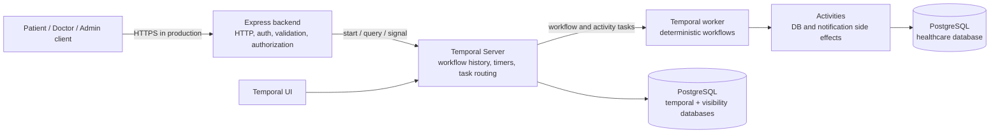
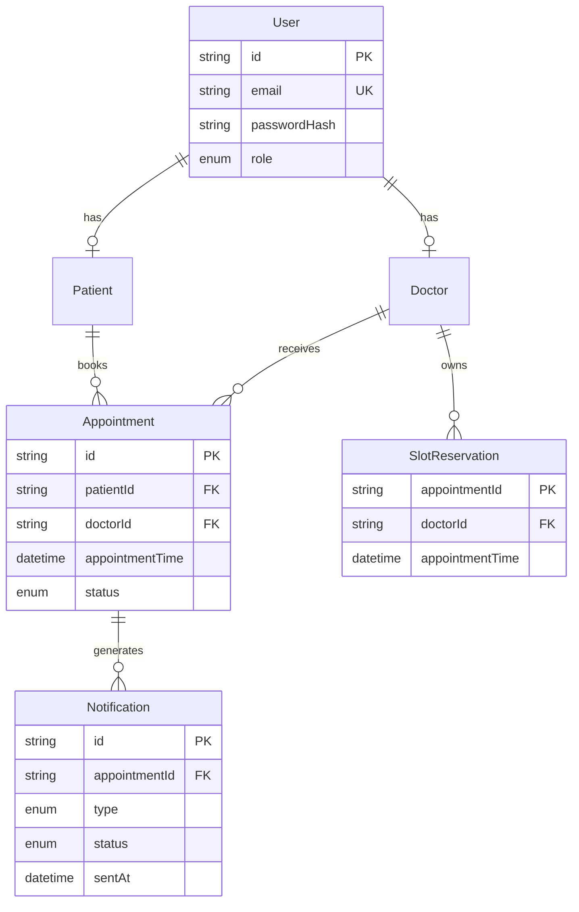
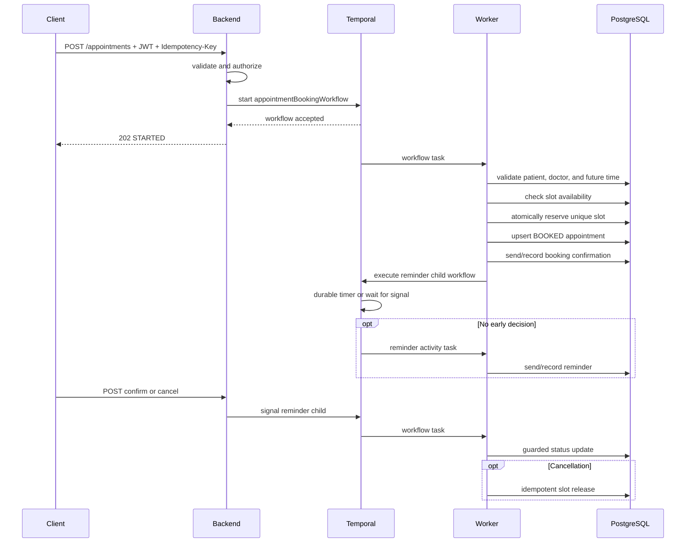
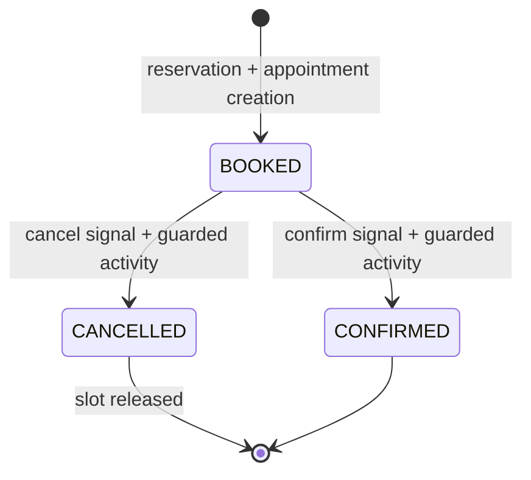

# Temporal Healthcare Appointment System — Technical Report

**Report basis:** repository implementation inspected on 24 August 2026  
**System version:** `temporal-healthcare-appointments` 1.0.0  
**Purpose:** explain the architecture, runtime behavior, technology choices, build process, failure tolerance, security posture, testing, limitations, and production evolution of the system.

## 1. Executive summary

This project is a small, production-minded healthcare appointment orchestration service. A patient authenticates through an HTTP API, requests an appointment with a doctor, and receives an asynchronous booking operation. Temporal durably coordinates validation, doctor-slot reservation, appointment creation, booking notification, a long-running reminder timer, and a later human decision to confirm or cancel.

The core design separates two kinds of state:

- **PostgreSQL is the business-data source of truth.** It stores users, patients, doctors, appointments, slot reservations, and notification records.
- **Temporal is the process-state source of truth.** It stores workflow history, activity attempts, timers, signals, child-workflow relationships, and execution completion or failure.

The system is intentionally split into an HTTP backend and a Temporal worker. The backend handles authentication, authorization, validation, and Temporal client commands. The worker executes deterministic workflows and side-effecting activities. Because Temporal persists execution history, the process can wait for hours or days without keeping an application thread, process, or in-memory timer alive.

The strongest reliability properties are durable workflow state, retryable activities, database-enforced double-booking prevention, caller-scoped API idempotency, idempotent database activities, and Saga compensation when appointment creation fails after reserving a slot. The design provides **at-least-once activity execution with idempotent effects**, not universal exactly-once delivery. A real email/SMS provider must support idempotency or be integrated through a transactional outbox.

## 2. Scope and intended use

The implemented business journey is deliberately narrow:

1. A user logs in.
2. A patient or administrator requests a future appointment.
3. The system validates the patient, doctor, time, and slot.
4. It atomically reserves the doctor's slot.
5. It creates a `BOOKED` appointment.
6. It records a booking-confirmation notification.
7. It starts a reminder child workflow.
8. The child waits until the reminder time or until an early confirm/cancel signal arrives.
9. If still undecided at reminder time, it sends one logical reminder.
10. It waits for the patient or an administrator to confirm or cancel.
11. Confirmation changes the appointment to `CONFIRMED`.
12. Cancellation changes it to `CANCELLED` and releases the slot.

The repository is a learning/demo system, not a complete hospital platform. It now models a fixed 20-minute appointment duration, but it does not implement provider working calendars, variable duration, rescheduling, completion, clinical records, billing, token revocation, or full regulatory controls.

## 3. High-level architecture



In local Docker Compose, the Temporal persistence databases and healthcare database use the same PostgreSQL container but separate databases and owners. This is convenient for development, but it is not high availability and should not be interpreted as production isolation.

### 3.1 Runtime processes

| Process/service | Responsibility | Does not do |
|---|---|---|
| Client | Calls login and appointment APIs | Does not directly access Temporal or PostgreSQL |
| Express backend | Validates HTTP, authenticates JWTs, authorizes object access, starts/queries/signals workflows | Does not execute workflow or activity code |
| Temporal Server | Persists event history, schedules tasks/retries/timers, routes signals and queries | Does not execute application business code |
| Temporal worker | Polls `healthcare-appointments`, replays workflows, executes activities | Does not expose HTTP endpoints |
| PostgreSQL | Enforces and stores business records and Temporal persistence | Does not orchestrate long-running business logic |
| Temporal UI | Displays workflow histories and operational state | Is not an application-facing business API |

### 3.2 Code boundaries

The source tree reflects the runtime separation:

```text
src/
├── backend/
│   ├── api/                 REST controllers, routes, schemas, middleware
│   ├── auth/                login, JWT verification, authorization
│   ├── temporal/            reused Temporal client connection
│   ├── app.ts               Express application assembly
│   └── server.ts            backend entry point and shutdown
├── worker/
│   ├── activities/          PostgreSQL and notification side effects
│   ├── workflows/           booking parent and reminder child workflows
│   └── worker.ts            worker entry point and concurrency settings
└── shared/
    ├── config/              validated environment configuration
    ├── database/            Prisma client
    ├── logging/             structured logger
    └── temporal/            cross-boundary contracts, signals, and queries
```

Architecture tests enforce that the backend cannot import worker implementation modules, the worker cannot import backend implementation modules, shared modules do not depend on either implementation, and workflows do not import infrastructure such as Prisma, configuration, logging, HTTP, filesystem, or crypto packages.

## 4. Technology stack and why it was chosen

### 4.1 Stack inventory

| Layer | Technology and repository version | Role |
|---|---|---|
| Runtime | Node.js 20 | Runs backend, worker, migrations, and seed code |
| Language | TypeScript 5.9, strict mode, ES2022 target | Static contracts and safer refactoring |
| HTTP | Express 5.1 | Small REST API and middleware pipeline |
| Orchestration | Temporal Server 1.27.2; TypeScript SDK 1.13.2 | Durable workflows, activities, timers, retries, signals, queries, child workflows |
| Database | PostgreSQL 16.10 Alpine | Relational business data and integrity constraints |
| ORM/migrations | Prisma 6.12 | Typed queries, schema definition, migration, and seed support |
| Validation | Zod 4.1 | Runtime validation for environment and untrusted HTTP input |
| Authentication | bcryptjs 3.0 and jsonwebtoken 9.0 | Password verification and signed bearer tokens |
| API protection | Helmet, CORS, express-rate-limit | Security headers, origin policy, and basic abuse control |
| Logging | Pino 9.9 | Fast structured JSON logging with redaction |
| Testing | Vitest 3.2 and `@temporalio/testing` | Unit tests and time-skipping workflow tests |
| Packaging | Docker multi-stage build and Docker Compose | Repeatable local environment and separate process entry points |

All major package versions are pinned in `package.json`/`package-lock.json`, and container images are pinned to explicit tags.

### 4.2 Why Temporal

Appointment scheduling is not only a CRUD operation. It includes a long wait, human interaction, external side effects, retries, and recovery after process failure. Implementing this without an orchestrator normally requires a combination of scheduled jobs, polling tables, an event broker, retry tables, distributed locks, state-machine code, and operational reconciliation.

Temporal was selected because it provides these concerns in one execution model:

- durable event history and deterministic replay;
- durable timers that do not depend on a running Node.js process;
- configurable activity timeouts, retry policies, and backoff;
- signals for asynchronous human actions;
- queries for read-only workflow state;
- child workflows for separating booking from the long reminder lifecycle;
- stable workflow IDs for business idempotency;
- operational visibility through the Temporal UI.

The tradeoff is additional infrastructure and a strict workflow-programming model. Workflow code must be deterministic and should be versioned carefully during deployment. Temporal also does not remove the need for database constraints, idempotent activities, security controls, or external-provider delivery design.

### 4.3 Why Node.js and TypeScript

The Temporal TypeScript SDK integrates naturally with an Express API and allows shared compile-time contracts across the client, workflows, signals, queries, and activities. Node.js is appropriate for the I/O-heavy API and worker activities. Strict TypeScript catches mismatched activity input, invalid workflow results, and boundary changes before runtime.

The main tradeoffs are a single-threaded JavaScript execution model for application code and the need to avoid CPU-heavy activities in the worker process. Worker concurrency is therefore explicitly bounded.

### 4.4 Why Express

Express keeps the HTTP boundary small and transparent. Its middleware model fits authentication, request IDs, JSON limits, rate limiting, error normalization, Helmet, and CORS without imposing a large framework structure. For a larger healthcare platform, a more opinionated framework could add dependency injection and module conventions, but it would not change the Temporal architecture.

### 4.5 Why PostgreSQL and Prisma

Appointments, users, doctors, and reservations are relational data with important uniqueness and foreign-key rules. PostgreSQL supplies atomic writes and database-level constraints: exact-start uniqueness plus a GiST exclusion constraint prevents concurrent overlapping 20-minute reservations for one doctor. Prisma supplies generated types, parameterized queries, migrations, narrow projections, and readable upsert/update operations.

Temporal and PostgreSQL solve different problems. Temporal ensures that process steps resume; PostgreSQL decides whether a business invariant, such as unique slot ownership, is true at the moment of an atomic write.

### 4.6 Why Docker Compose

Compose makes the five local services—PostgreSQL, Temporal, Temporal UI, backend, and worker—reproducible with health-based startup ordering. The backend and worker reuse one application image because their dependencies overlap, while still running as independent containers with different commands and scaling characteristics.

Compose is a development/deployment demonstration, not a high-availability production platform. Production should use managed or clustered persistence, multiple workers/backends, secure networking, and an orchestrator such as Kubernetes or an equivalent managed runtime.

## 5. Data architecture

### 5.1 Entity model



### 5.2 Integrity rules

- `User.email` is unique.
- Each `User` can link to at most one patient and at most one doctor record.
- Appointment patient and doctor IDs are foreign keys.
- `SlotReservation.appointmentId` is the primary key, making repeated reservation for the same appointment idempotent.
- `(SlotReservation.doctorId, appointmentTime)` remains unique, while a customized PostgreSQL exclusion constraint rejects any overlapping protected 20-minute ranges for the same doctor.
- `(Notification.appointmentId, type)` is unique, allowing one logical booking confirmation and one logical reminder per appointment.
- Appointment indexes support lookup by patient, time, and status.

`AppointmentStatus` declares `PENDING`, `BOOKED`, `CONFIRMED`, `CANCELLED`, and `COMPLETED`. The current workflow uses only `BOOKED`, `CONFIRMED`, and `CANCELLED`; the other values are reserved/unimplemented. Notification records use `PENDING`, `SENT`, and `FAILED`, although the current adapter directly writes `SENT` and does not persist failed attempts.

## 6. API and access-control model

| Method and route | Purpose | Authorization | Successful response |
|---|---|---|---|
| `POST /auth/login` | Verify credentials and return JWT | Public, rate-limited | `200` token and expiry |
| `GET /health` | Check API/database readiness | Public | `200` or `503` |
| `POST /appointments` | Start booking workflow | Patient owning `patientId`, or admin | `202 STARTED`; `200 ALREADY_STARTED` |
| `GET /appointments/:id` | Read persisted appointment | Owning patient, assigned doctor, or admin | `200` appointment |
| `GET /appointments/:id/workflow` | Query reminder child state | Same as appointment read | `200` workflow state |
| `POST /appointments/:id/confirm` | Send confirm signal | Owning patient or admin | `202` accepted |
| `POST /appointments/:id/cancel` | Send cancel signal | Owning patient or admin | `202` accepted |

The API returns acceptance for asynchronous commands. `202` means Temporal accepted the start or signal; it does not mean all downstream activities have completed.

### 6.1 Request processing path

Every protected request follows this sequence:

1. Helmet and CORS policies are applied.
2. Strict JSON parsing limits the request body to 32 KB.
3. A validated caller-supplied request ID or generated UUID is attached.
4. A bearer JWT is verified for signature and expiry.
5. Zod validates route parameters, body fields, IDs, and timestamps.
6. Object-level authorization checks role and patient/doctor ownership.
7. The service calls Temporal or PostgreSQL.
8. Errors are converted to stable JSON error codes without returning stack traces.
9. A structured completion log records method, path, status, request ID, and duration.

### 6.2 Authentication and authorization

Passwords are hashed with bcrypt cost 12. Login issues an HMAC-signed JWT with a default one-hour expiry. Claims contain the user ID, role, and linked patient or doctor ID. Patients can create, read, confirm, and cancel only their own appointments. Doctors can read appointments assigned to them but cannot perform patient confirm/cancel actions. Administrators have broad demo access.

The design correctly treats possession of an appointment ID as insufficient authorization. Each object action loads the relevant ownership attributes and applies a policy check.

## 7. End-to-end booking workflow



### 7.1 API idempotency and workflow start

`POST /appointments` requires an `Idempotency-Key` of 8–100 safe characters. The backend hashes `userId:idempotencyKey` and uses the first 24 hex characters to derive a stable appointment ID. This scopes the key to the authenticated caller, so two users may safely use the same textual key.

The booking workflow ID is `appointment-<appointmentId>`. Temporal is configured with:

- `WorkflowIdConflictPolicy.FAIL`, which rejects another start while the workflow ID is open;
- `WorkflowIdReusePolicy.REJECT_DUPLICATE`, which rejects reuse after an earlier run closes.

If the client times out or the backend loses the HTTP response after Temporal accepted the start, resending the same request with the same key returns `ALREADY_STARTED` instead of creating another appointment.

One consequence is that the idempotency key is bound only to the user, not to a hash of the request body. Reusing a key with different doctor/time input still refers to the first operation; the API does not report an idempotency-payload mismatch.

### 7.2 Booking parent workflow

`appointmentBookingWorkflow` performs these ordered steps:

1. `validateAppointmentRequest`: revalidates that the time is future and that patient and doctor records exist.
2. `checkDoctorAvailability`: provides a fast, readable business rejection if the slot already has a reservation.
3. `reserveAppointmentSlot`: performs the authoritative atomic reservation.
4. `createAppointment`: upserts the `BOOKED` appointment.
5. `sendBookingConfirmation`: logs and records one booking confirmation.
6. `executeChild(appointmentReminderWorkflow)`: creates and waits for the reminder child workflow.

The initial availability check improves diagnostics but does not provide concurrency safety by itself. The PostgreSQL exact-start and range-exclusion constraints in step 3 are the final authority.

The parent uses `executeChild`, so it remains open until the reminder child completes. This preserves a clear parent/child execution tree in Temporal UI.

### 7.3 Reminder child workflow

The child starts with this in-memory state, which Temporal can reconstruct from history:

```text
status = SCHEDULED
reminderSent = false
confirmed = false
cancelled = false
```

It registers:

- an `appointmentState` query that returns a defensive copy of state;
- a `confirmAppointment` signal that sets `confirmed` unless already cancelled;
- a `cancelAppointment` signal that sets `cancelled` unless already confirmed.

It calculates `appointmentTime - reminderLeadTimeSeconds`. If that time is in the future, it races a durable Temporal timer against a condition for confirm/cancel. An early decision ends the wait and avoids an unnecessary reminder. If the timer wins and there is no decision, the workflow sends a reminder, sets `WAITING_FOR_CONFIRMATION`, and waits indefinitely for a decision.

Temporal processes workflow events deterministically. If confirm and cancel arrive close together, the first signal recorded in event history wins because each handler refuses to reverse the opposing flag.

### 7.4 Appointment state transitions



The Temporal child exposes richer orchestration states—`SCHEDULED`, `WAITING_FOR_CONFIRMATION`, `CONFIRMED`, and `CANCELLED`—while PostgreSQL exposes the business entity status. These views are related but not atomically updated together, so brief eventual-consistency windows are expected.

## 8. How Temporal provides durability

### 8.1 Event history and replay

Workflow code does not persist its JavaScript variables directly to PostgreSQL. Temporal records the workflow's meaningful events: workflow start, scheduled/completed/failed activities, timers, child workflow events, signals, and completion. After a worker crash or deployment, another worker loads the history and replays the deterministic workflow code to reconstruct the same state.

During replay, completed activities are not executed again merely to rebuild state; their recorded results are supplied from history. New commands are produced only after replay reaches the end of recorded history.

### 8.2 Task queues

The backend and worker agree on the configured `healthcare-appointments` task queue. The task queue is a durable routing abstraction. If no worker is running, workflow/activity tasks remain available until a compatible worker polls them. It is not an application-managed RabbitMQ/Kafka queue, and application code does not acknowledge messages manually.

### 8.3 Durable timers

Temporal `sleep` creates a timer in Temporal's persisted execution state. It consumes no dedicated application thread while waiting. If the worker is offline when the timer becomes due, the timer event remains recorded and the workflow continues when a worker returns.

### 8.4 Signals and queries

Signals are durable asynchronous messages added to workflow history. The HTTP signal response confirms Temporal accepted the message, not that the database status update is finished. Queries are read-only synchronous inspections of current workflow state; they are not written into history and must not perform side effects.

### 8.5 Determinism

Workflow modules use Temporal workflow APIs and input values, not Prisma, environment reads, logging infrastructure, network calls, filesystem access, or Node crypto. The backend copies reminder lead time into workflow input, ensuring replay does not depend on a later environment change. External work occurs only in activities.

Future workflow changes still require compatibility discipline. Deployments should use Temporal worker versioning/build IDs or patching/version markers when a code change would alter commands for existing histories.

## 9. Failure-tolerance design

### 9.1 Retry policies and timeouts

| Activity group | Start-to-close | Schedule-to-close | Maximum attempts | Retry behavior |
|---|---:|---:|---:|---|
| Validation/availability | 5 seconds | 15 seconds | 3 | 1-second initial interval, up to 3 seconds |
| Reservation/creation/compensation | 10 seconds | 45 seconds | 4 | exponential 2× backoff, up to 8 seconds |
| Booking notification | 10 seconds | 1 minute | 5 | exponential 2× backoff, up to 10 seconds |
| Reminder/status/release | 10 seconds | 1 minute | 5 | exponential 2× backoff, up to 10 seconds |

The timeouts prevent a stuck database/provider call from occupying an activity forever. Heartbeats are not configured because every activity is designed to be short-lived; heartbeats would become useful for long-running or chunked activities.

Business failures are marked non-retryable when another attempt cannot make them valid: past appointment time, missing patient, missing doctor, unavailable slot, rejected creation, or invalid status transition. Infrastructure-style exceptions are retried within the configured limits.

### 9.2 Idempotent activities

Temporal activities have at-least-once execution semantics. A worker can commit a side effect and crash before reporting completion, causing Temporal to retry. The activities are designed to tolerate that ambiguity:

| Activity/effect | Idempotency mechanism |
|---|---|
| Reserve slot | Upsert by stable `appointmentId`; unique doctor/time constraint |
| Create appointment | Upsert by stable appointment primary key |
| Release slot | `deleteMany`, so deleting an absent row succeeds |
| Record notification | Unique appointment/type key and upsert |
| Confirm/cancel | Guarded update from `BOOKED`; already-at-target counts as success |
| Start workflow | Stable workflow ID plus duplicate-rejection policies |

This design aims for one logical business effect even if an activity function runs multiple times.

### 9.3 Saga compensation

Reservation and appointment creation cannot be one transaction because Temporal schedules them as separate activities. The parent workflow therefore implements a small Saga:

```text
reserve slot
try create appointment
if creation permanently fails or exhausts retries:
    release slot
    fail workflow
```

Compensation is delayed until creation retry attempts are exhausted, preventing a transient database failure from prematurely giving the slot to another patient. Slot release is itself idempotent and retryable.

The compensation scope is intentionally limited. A booking-confirmation failure occurs after the appointment has been created and is not compensated, so the appointment and reservation remain. This is usually safer than deleting a valid booking because a notification service failed, but the workflow will fail after notification retries and the reminder child will not start. Production requires an explicit policy, such as allowing the booking to continue while a separate notification-delivery workflow retries for longer.

### 9.4 Failure scenario analysis

| Failure scenario | Current behavior | Result/recovery |
|---|---|---|
| Client repeats create request | Stable caller-scoped workflow ID is reused | No duplicate workflow or appointment |
| Backend crashes before Temporal accepts start | No durable operation exists | Client retries with the same key |
| Backend crashes after Temporal accepts start but before HTTP response | Workflow continues in Temporal | Client retry returns `ALREADY_STARTED` |
| Backend is offline during an active workflow | Worker and Temporal continue | API access is unavailable; process state is preserved |
| Worker crashes between workflow tasks | History remains in Temporal | Restarted/other worker replays and continues |
| Worker crashes after DB commit but before activity completion | Activity may retry | Upsert/guard/unique/delete logic prevents duplicate logical effect |
| Worker is offline when reminder becomes due | Timer fires durably in Temporal | Reminder task runs when a worker returns |
| Two patients race for one doctor/time | One unique reservation insert wins | Loser gets non-retryable `DOCTOR_UNAVAILABLE` workflow failure |
| Temporary notification error | Temporal retries with backoff | Demonstrated test succeeds on second attempt |
| Permanent appointment creation error | Creation fails without wasteful retries | Slot-release compensation runs, workflow fails |
| Confirm/cancel signal is repeated | Boolean handler and idempotent status activity tolerate repetition | Final state is unchanged |
| Confirm and cancel race | Temporal history gives a deterministic event order | First recorded decision wins |
| PostgreSQL is briefly unavailable | Activities retry within bounded policies | Workflow continues if DB returns before exhaustion |
| PostgreSQL stays unavailable | Attempts eventually exhaust | Workflow/activity fails; manual/automated remediation may be required |
| Temporal is unavailable during API start/signal/query | Backend converts failure to `503` | Client must retry; no local command buffer exists |
| Temporal Server restarts in local Compose | Event history persists in PostgreSQL volume | Server recovers if the single database/volume is healthy |

### 9.5 Exactly-once boundaries

The database prevents duplicate notification **records**, but the demo notification provider is only a structured log. In a real integration there is a failure window:

1. provider accepts an email/SMS;
2. worker crashes before storing `SENT`;
3. Temporal retries;
4. provider may send a duplicate.

No transaction can atomically commit both the local PostgreSQL row and an unrelated provider request. A production solution should use at least one of:

- provider-supported idempotency keyed by `appointmentId + notificationType`;
- a transactional outbox written with business state, plus an idempotent delivery consumer;
- a dedicated long-running delivery workflow with provider idempotency and reconciliation.

Therefore the correct reliability statement is: **durable orchestration and idempotent local effects, with at-least-once activity attempts**. It is not blanket exactly-once processing.

### 9.6 Important failure gaps

The following cases need strengthening before production:

- If booking-confirmation retries exhaust, the booking remains `BOOKED` and reserved, the parent fails, and the reminder child is never started.
- If compensation cannot reach PostgreSQL after creation fails, slot release can also exhaust retries, potentially requiring reconciliation for an orphan reservation.
- There is no scheduled reconciliation process for failed workflows, orphan reservations, stuck `BOOKED` appointments, or undelivered notifications.
- The local Temporal Server and all databases depend on one PostgreSQL container/volume; this is a single failure domain.
- The API has no durable local outbox for Temporal commands. A Temporal outage causes `503`, relying on the caller to retry.
- A signal cannot be sent through the current API until the appointment row and reminder child exist; there is a short not-found/not-ready interval after create acceptance.
- Activity retries are bounded. Durability preserves history, but it does not automatically turn a terminally failed activity into infinite recovery.

## 10. Security and healthcare-data posture

### 10.1 Implemented controls

- JWT authentication with expiry and a minimum 32-character configured signing secret.
- bcrypt password hashes; plaintext passwords are neither stored nor returned.
- role and object-level authorization for every protected appointment operation.
- strict Zod validation, unknown-field rejection, safe ID patterns, future/offset-aware timestamps, and server-controlled status.
- Helmet security headers, explicit CORS origin, small JSON limit, login/mutation rate limiting, and disabled `x-powered-by`.
- parameterized Prisma queries and relational integrity constraints.
- a dedicated application database/user separate from Temporal database ownership.
- structured logs with authorization, password, hash, token, and secret redaction paths.
- request correlation IDs and safe client error responses.
- minimized workflow payload: opaque IDs, appointment time, and lead-time configuration; no JWT, password, name, diagnosis, or clinical record enters workflow history.
- multi-stage image, pinned dependencies/images, non-root Node runtime, and no host-published PostgreSQL or Temporal gRPC ports.

### 10.2 Controls still required for production

Local Compose traffic and named volumes are not application-encrypted. A real healthcare deployment requires HTTPS, database TLS, Temporal TLS/mTLS where appropriate, encryption at rest, managed keys and secrets, rotation, backup/restore testing, private networking, immutable audit storage, centralized monitoring, alerting, retention/deletion controls, vulnerability management, and incident response.

The demo JWT design has no refresh, revocation, audience/issuer enforcement, signing-key rotation, or external identity provider. The in-memory rate limiter does not coordinate across multiple backend replicas. Demo accounts share a known password and must never exist in a real environment.

The architecture applies sound security principles but does not by itself establish HIPAA, GDPR, Sri Lankan PDPA, or other compliance. Compliance also depends on organizational procedures, hosting, contracts, access governance, audit policy, consent, retention, and jurisdiction-specific legal review.

## 11. Configuration

| Variable | Purpose | Default/constraint |
|---|---|---|
| `NODE_ENV` | Runtime mode | `development`; development/test/production |
| `DATABASE_URL` | Healthcare PostgreSQL connection | Required |
| `TEMPORAL_ADDRESS` | Temporal gRPC endpoint | `temporal:7233` |
| `TEMPORAL_NAMESPACE` | Workflow namespace | `default` |
| `TEMPORAL_TASK_QUEUE` | Backend/worker routing name | `healthcare-appointments` |
| `JWT_SECRET` | JWT HMAC secret | Required, at least 32 characters |
| `JWT_EXPIRES_IN` | Token lifetime | `1h` |
| `PORT` | API port | `3000` |
| `CORS_ORIGIN` | Allowed browser origin | `http://localhost:3000` |
| `REMINDER_LEAD_TIME_SECONDS` | Time before appointment to remind | `30` in demo |
| `LOG_LEVEL` | Pino verbosity | `info` |
| `DEMO_FAILURE_MODE` | Controlled failure injection | `none`, `notification-once`, or `create-permanent` |

Configuration is parsed once with Zod and fails fast on invalid values. Secrets should be injected from a production secret manager. Workflow-relevant configuration is copied into workflow input rather than read during workflow execution.

## 12. Build, package, and deployment process

### 12.1 Local validation

```powershell
npm.cmd ci
npm.cmd run check
```

`check` generates the Prisma client, compiles TypeScript, and runs all tests. On systems where PowerShell blocks `npm.ps1`, use `npm.cmd` as shown.

### 12.2 Docker image build

The multi-stage Dockerfile performs the following:

1. starts from pinned Node 20.19.5 Debian slim;
2. installs OpenSSL required by Prisma;
3. copies lockfiles and runs deterministic `npm ci`;
4. copies the Prisma schema and generates the client;
5. copies TypeScript source/tests and compiles to `dist`;
6. creates a clean runtime stage;
7. copies package metadata, dependencies, compiled output, and Prisma assets;
8. changes ownership and runs as the unprivileged `node` user.

The same image supports both application processes. Compose runs:

- backend: migrations, idempotent seed, then `dist/src/backend/server.js`;
- worker: `dist/src/worker/worker.js`.

The `package.json` `worker` script currently points to `dist/worker/worker.js`, which does not match the configured TypeScript output path. Compose uses the correct path, but the standalone script should be corrected before relying on `npm run worker`.

### 12.3 Local environment startup

```powershell
docker compose up --build
```

Compose startup order is health-gated:

1. PostgreSQL initializes the healthcare, Temporal, and visibility databases.
2. Temporal auto-setup connects and migrates its stores.
3. Temporal UI connects to Temporal.
4. Backend deploys Prisma migrations, runs the idempotent seed, connects to PostgreSQL and Temporal, and exposes port 3000.
5. Worker waits for backend/Temporal health and polls the task queue.

Available local endpoints are API `http://localhost:3000`, health `http://localhost:3000/health`, and Temporal UI `http://localhost:8080`.

The database init SQL runs only when PostgreSQL initializes a new data directory. Existing volumes are not automatically reinitialized if that SQL changes.

### 12.4 Production deployment shape

A stronger deployment would include:

- multiple stateless backend replicas behind a TLS load balancer;
- multiple worker replicas polling the same versioned task queue;
- managed Temporal Cloud or a properly operated multi-node Temporal cluster;
- managed high-availability PostgreSQL with backups and point-in-time recovery;
- migrations as a one-off deployment job, not in every API replica startup;
- a shared rate-limit store;
- centralized secrets, logs, metrics, traces, alerts, and audit events;
- worker versioning for safe workflow-code rollout;
- a real notification adapter with outbox/idempotency and reconciliation.

Backend and worker replicas scale independently. Increasing backend replicas improves request capacity; increasing worker replicas improves workflow/activity throughput. Temporal routes tasks so only one worker handles a given workflow task at a time, while PostgreSQL constraints protect business races across activities.

## 13. Performance and scalability

The backend reuses one Temporal connection/client and one Prisma client per process. The worker bounds activity execution at 20 concurrent tasks and workflow-task execution at 50. Workflow payloads are small, and workflows perform no database or network I/O directly. Independent patient/doctor lookups run in parallel. Queries use narrow Prisma projections and supporting indexes.

The present capacity settings are reasonable demo defaults, not measured production values. Production tuning should use queue latency, activity duration, database pool saturation, CPU, event-history size, retry counts, and provider rate-limit metrics. PostgreSQL connection pools must be sized across all backend and worker replicas.

Long waits do not consume a worker thread, but each workflow retains event history. The current appointment lifecycle has very few events. If rescheduling, conversations, or repeated reminder campaigns cause histories to grow substantially, use Continue-As-New or child workflows to keep history bounded.

## 14. Observability and operations

Pino emits structured events for backend startup/shutdown, HTTP requests, workflow starts, appointment signals, worker connection retries, notification sends, and fatal failures. Sensitive paths are redacted. Request IDs are returned in `x-request-id` and included in relevant logs.

Temporal UI exposes parent/child relationships, activity attempts, retry delays, timers, signals, workflow failures, and final results. Search by:

```text
appointment-<appointmentId>
appointment-reminder-<appointmentId>
```

The current `/health` endpoint actively checks only PostgreSQL. It reports `temporalClient: ready` because the backend connected during startup, but it does not perform a live Temporal health RPC on each request. Production should separate liveness from readiness and check the dependencies required to safely accept new commands.

Recommended operational metrics and alerts include:

- Temporal task-queue schedule-to-start latency;
- failed/timed-out workflows and activities by error type;
- activity retry counts and durations;
- workflows waiting unusually long for confirmation;
- booking-to-confirmation conversion and cancellation rates without patient-identifying labels;
- PostgreSQL connection/lock/replication health;
- orphan reservations and `BOOKED` appointments without a running child workflow;
- notification backlog, age, failure, and deduplication counts;
- API error rate, latency, rate-limit decisions, and auth failures.

## 15. Testing and current verification

The repository contains three test suites and 14 tests:

- architecture boundary enforcement;
- request validation and caller-scoped idempotency;
- patient, doctor, and administrator authorization;
- durable reminder timing through Temporal's time-skipping test environment;
- workflow-state query behavior;
- confirm and cancel signals;
- cancellation slot release;
- transient reminder failure retry;
- permanent creation failure and Saga compensation.

For this report, `npm.cmd exec tsc -- --noEmit -p tsconfig.json` completed successfully and all 14 Vitest tests passed. The combined `npm run check` and emitting build could not replace existing generated files in this Windows workspace because the OS returned `EPERM` for files under `node_modules/.prisma` and `dist`; this was a local file-access condition, not a TypeScript or test failure.

Important missing tests include real PostgreSQL integration tests, concurrent reservation races against the actual unique constraint, API integration/authentication tests, container smoke tests, backend/worker crash recovery, notification crash-after-send behavior, Temporal outage behavior, and migration/restore tests.

## 16. Known limitations and risks

### High priority before production

1. Implement provider-level notification idempotency or a transactional outbox.
2. Define recovery for exhausted booking-confirmation/reminder retries and orphan reservations.
3. Add workflow failure monitoring and automated reconciliation.
4. Deploy highly available Temporal and PostgreSQL rather than the single local database container.
5. Add TLS, managed secrets/keys, encrypted storage/backups, and immutable audit records.
6. Introduce safe Temporal worker versioning for workflow-code deployments.
7. Replace demo identity/JWT controls and in-memory rate limiting with production services.

### Functional limitations

- Booking is asynchronous; conflicts appear as failed workflows rather than immediate HTTP `409` responses.
- Reads may return not found briefly after a successful `202` because the workflow has not yet created the appointment row.
- Workflow queries/signals may return not ready before the child starts.
- There is no operation-status resource for booking failures before appointment creation.
- No reschedule, completion, expiry/no-response, doctor decision, variable appointment duration, timezone policy, recurrence, working-hours calendar, or blackout-period model exists. Appointment duration is currently fixed at 20 minutes.
- Cancellation releases the slot; confirmation retains the reservation permanently because there is no completion/retention cleanup path.
- `PENDING`, `COMPLETED`, notification `PENDING`, notification `FAILED`, and workflow contract states `BOOKING`/`FAILED` are not currently driven by the implementation.

### Technical limitations

- Health reporting does not actively validate Temporal availability.
- The backend maps most Temporal start errors to a generic `503`, limiting diagnosis for callers.
- The idempotency record does not retain/compare a request payload hash.
- No Temporal Search Attributes are configured for patient-safe operational filtering.
- No tracing or metrics exporter is configured.
- No retention policy is documented for appointment data, notification records, logs, or Temporal histories.
- Migrations and seeding run in backend startup, which can become problematic with horizontally scaled replicas.
- The standalone `npm run worker` output path is incorrect, although Compose is correct.

## 17. Recommended evolution plan

### Phase 1 — reliability completion

- Add an explicit booking-operation status/read model covering pre-appointment workflow failures.
- Move notification delivery into an outbox or dedicated delivery workflow with provider idempotency.
- Add reconciliation workflows/jobs for failed workflows, orphan reservations, and undelivered notifications.
- Define terminal policy for appointments that are never confirmed.
- Add real PostgreSQL concurrency and failure-recovery integration tests.

### Phase 2 — production security and operations

- Integrate a managed identity provider and short-lived asymmetric tokens with issuer/audience validation.
- Add TLS/mTLS, secret manager integration, encrypted persistence/backups, network policies, and least-privilege grants.
- Implement immutable audit records and privacy-aware metrics/tracing.
- Separate liveness/readiness and add live Temporal, database, and queue-latency monitoring.
- Adopt managed Temporal or a highly available cluster and managed PostgreSQL.

### Phase 3 — product capabilities and scale

- Model appointment duration, doctor working hours, blackout periods, timezones, and capacity.
- Add reschedule, completion, no-show, expiry, and multiple reminder policies.
- Use Temporal Updates when a caller needs a synchronous, workflow-validated state transition result.
- Add Search Attributes containing only approved non-sensitive operational metadata.
- Apply worker versioning and compatibility tests to every workflow deployment.
- Tune task queues, worker concurrency, and database pools from measured production load.

## 18. Overall assessment

The system is a strong compact demonstration of the correct division between durable orchestration and transactional business storage. It uses Temporal for long-running execution, PostgreSQL for atomic invariants, and idempotent activities to bridge at-least-once execution safely. Its backend/worker separation, deterministic workflow boundary, input and authorization controls, database uniqueness, time-skipping tests, and explicit compensation are all sound architectural choices.

Its reliability is intentionally bounded rather than absolute. Durable history survives process crashes, but exhausted retries still require a business recovery policy. Local database operations are idempotent, but real external notification delivery needs provider idempotency or an outbox. Docker Compose demonstrates the system but does not provide high availability or regulatory compliance. With the reliability, security, observability, deployment-versioning, and reconciliation improvements listed above, the architecture can evolve into a production-grade appointment platform without replacing its central Temporal/PostgreSQL design.

## 19. Key implementation references

| Concern | File |
|---|---|
| API assembly and security middleware | `src/backend/app.ts` |
| Appointment API orchestration | `src/backend/api/appointment.service.ts` |
| Authentication and authorization | `src/backend/auth/` |
| Booking parent workflow | `src/worker/workflows/appointmentBooking.workflow.ts` |
| Reminder child workflow | `src/worker/workflows/appointmentReminder.workflow.ts` |
| Activity retry-safe effects | `src/worker/activities/appointment.activities.ts` |
| Shared Temporal contracts/signals/queries | `src/shared/temporal/` |
| Database model and invariants | `prisma/schema.prisma` |
| Runtime topology | `docker-compose.yml` |
| Image construction | `Dockerfile` |
| Architecture, authorization, and workflow tests | `tests/` |
